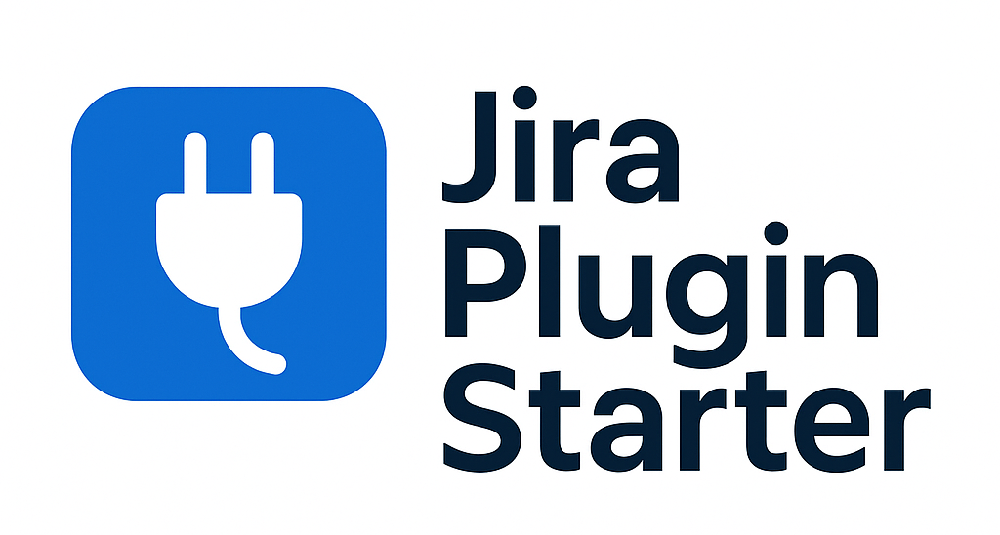
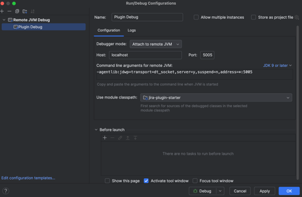

# Jira DC Plugin Starter




⚡️ Jira Plugin Starter is a modern, feature-ready template for quickly building server-side plugins for Jira Data Center.
It includes pre-configured tools and structure - everything you need to get started with modern tooling and best practices.

Backend:
- Maven, Java, the Atlassian Plugin SDK

Frontend:
- pNpm, React 18, TypeScript, Eslint, and Atlaskit

This repository follows the principle of **"Grab It All – Use Only What You Need"**.

## Getting Started

### Managing JDK versions

If you are using multiple JDK versions, you can use [jenv](https://www.jenv.be/) to manage them.
Place .java-version in the root of the project to set the JDK version. Current project JDK version is 17.

.java-version:
```text
17
```

### Install Atlassian Plugin SDK
Follow this instructions: [link](https://developer.atlassian.com/server/framework/atlassian-sdk/install-the-atlassian-sdk-on-a-linux-or-mac-system/)

Check sdk install correctly:
```shell
atlas-version
```
Example output:
```text
 % atlas-version

ATLAS Version:    9.1.1
ATLAS Home:       /opt/homebrew/Cellar/atlassian-plugin-sdk/9.1.1/libexec
ATLAS Scripts:    /opt/homebrew/Cellar/atlassian-plugin-sdk/9.1.1/libexec/bin
ATLAS Maven Home: /opt/homebrew/Cellar/atlassian-plugin-sdk/9.1.1/libexec/apache-maven-3.9.8
AMPS Version:     9.1.1
--------
Executing: /opt/homebrew/Cellar/atlassian-plugin-sdk/9.1.1/libexec/apache-maven-3.9.8/bin/mvn --version -gs /opt/homebrew/Cellar/atlassian-plugin-sdk/9.1.1/libexec/apache-maven-3.9.8/conf/settings.xml
Apache Maven 3.9.8 (36645f6c9b5079805ea5009217e36f2cffd34256)
Maven home: /opt/homebrew/Cellar/atlassian-plugin-sdk/9.1.1/libexec/apache-maven-3.9.8
Java version: 17.0.16, vendor: Eclipse Adoptium, runtime: /Library/Java/JavaVirtualMachines/temurin-17.jdk/Contents/Home
Default locale: en_US, platform encoding: UTF-8
OS name: "mac os x", version: "15.7.1", arch: "aarch64", family: "mac"
```

### Install pNpm
- Install npm - [link](https://docs.npmjs.com/downloading-and-installing-node-js-and-npm)
- Install pNpm - [link](https://pnpm.io/installation#using-corepack)

## Available Scripts and additional parameters

# Development Workflow

## Build
```shell
atlas-package
mvn package
```

## Lint

## Debug
Run Jira 
```shell
atlas-debug
```
Configure your IDE to debug Jira.



### View Jira logs
atlassian-jira.log
```shell
 tail -f target/jira/home/log/atlassian-jira.log
```

## Security Check

```
# owasp report
atlas-mvn org.owasp:dependency-check-maven:check

# dependency tree
atlas-mvn dependency:tree -DoutputType=dot -DoutputFile=maven_dependency_tree.gv
```

# Folders structure
## Backend
```bash
└── src
    └── main
        └── java # Java sources
            ├── .../model # Active Objects Entities
            ├── .../repository # Access to database
            ├── .../rest # REST API plugin resources
            ├── .../service # Service Components for plugin Business Logic
            └── .../web
                ├── .../action # Jira Web Actions
                ├── .../condition # Jira Web Conditions
                ├── .../filter # Web Filters
                ├── .../servlet # Servlets
        └── resources
            ├── atlassian-plugin.xml # plugin configuration
            ├── .../images/ # static images
            ├── .../i18n.properties # plugin default i18n file
            ├── .../templates/ # plugin velocity templates
            ├── META-INF
                ├── plugin-descriptors # Folder for atlassian-plugin.xml components
                ├── spring/plugin-context.xml # Spring configuration 
└── .gitignore
└── .java-version
└── pom.xml
└── quickreload.properties
```
## Frontend
```bash
└── js
    └── package.json
```
# FAQ

# Resources
- [Atlassian Plugin Tutorials Guides](https://developer.atlassian.com/server/framework/atlassian-sdk/tutorials-and-guides/)
  - Configuring the Velocity method allowlist - [link](https://developer.atlassian.com/server/framework/atlassian-sdk/configuring-the-velocity-allowlist/#configuring-the-velocity-method-allowlist)
  - Spring Java configuration of app components - [link](https://developer.atlassian.com/server/framework/atlassian-sdk/spring-java-config/)

# License

This project is licensed under the Apache 2.0 License.