# Jira DC Plugin Starter


⚡️ Jira Plugin Starter is a modern, feature-ready template for quickly building server-side plugins for Jira Data Center.
It includes pre-configured tools and structure - everything you need to get started with modern tooling and best practices.

Backend:
- Maven, Java, the Atlassian Plugin SDK

Frontend:
- pNpm, React 18, TypeScript, Eslint, and Atlaskit

This repository follows the principle of **"Grab It All – Use Only What You Need"**.

## Overview

### Key Advantages and Solutions

Jira DC Plugin Starter provides a comprehensive, modern foundation for developing Jira Data Center plugins, emphasizing productivity and adherence to best practices. Key advantages include:

- **Rapid Development Setup**: Pre-configured project structure and tools allow developers to start building immediately without manual configuration.
- **Modern Technology Stack**: Integrates cutting-edge technologies for both backend and frontend, ensuring scalable and maintainable code.
- **Best Practices Integration**: Includes linting, type checking, and security checks to maintain high code quality.
- **Flexible Architecture**: Follows a modular approach, enabling developers to use only the components they need while having access to a full suite of tools.

The project offers solutions for common development challenges:
- **Backend Solutions**: Leverages Maven for dependency management, Java for robust server-side logic, and the Atlassian Plugin SDK for seamless integration with Jira. Includes Spotless for code formatting and NullAway for null-safety analysis to ensure high code quality and prevent common errors.
- **Frontend Solutions**: Utilizes React 18 for dynamic user interfaces, TypeScript for type safety, ESLint for code quality, and Atlaskit for consistent Atlassian design components.

### Comparison with atlas-create-jira-plugin

While `atlas-create-jira-plugin` generates a basic Jira plugin skeleton using only Java and Maven, Jira DC Plugin Starter extends this foundation significantly:

- **Frontend Capabilities**: Unlike the basic plugin, this starter includes a complete frontend setup with React, TypeScript, and Atlaskit, enabling rich user interfaces and modern web development practices.
- **Enhanced Tooling**: Adds ESLint for code linting, pNpm for efficient package management, and pre-configured build tools, which are absent in the standard atlas-created plugin.
- **Best Practices and Structure**: Provides a more organized project structure with dedicated folders for models, repositories, services, and web components, promoting better code organization and maintainability.
- **Modern Dependencies**: Includes up-to-date versions of libraries and tools, such as React 18 and TypeScript, ensuring compatibility with current standards and reducing technical debt.

In summary, while `atlas-create-jira-plugin` is suitable for simple, backend-only plugins, Jira DC Plugin Starter is ideal for developers seeking a full-stack, production-ready template with modern tooling and best practices.

### Main Modules and Technologies Diagram

```mermaid
graph TB
    subgraph "Jira DC Plugin Starter"
        subgraph "Frontend Layer"
            React["React 18<br/>🔥 UI Framework"]
            TS["TypeScript<br/>📝 Type Safety"]
            Atlaskit["Atlaskit<br/>🎨 Design System"]
            Compiled["Compiled React<br/>⚡ CSS-in-JS"]
            TanStack["TanStack Query<br/>🔄 Data Fetching"]
            WRM["WRM React i18n<br/>🌐 Internationalization"]
        end

        subgraph "Build & Development Tools"
            Webpack["Webpack 5<br/>📦 Module Bundler"]
            Babel["Babel<br/>🔄 JS Transpiler"]
            ESLint["ESLint<br/>✅ Code Linting"]
            pNpm["pNpm<br/>📦 Package Manager"]
            Prettier["Prettier<br/>💅 Code Formatting"]
        end

        subgraph "Backend Layer"
            subgraph "Core Technologies"
                Java["Java 17<br/>☕ Programming Language"]
                Maven["Maven<br/>📦 Build Tool"]
                Spring["Spring<br/>🏗️ DI Framework"]
                AO["Active Objects<br/>🗄️ ORM"]
            end

            subgraph "Code Quality Tools"
                Spotless["Spotless<br/>💅 Code Formatter"]
                NullAway["NullAway<br/>🛡️ Null Safety"]
                ErrorProne["Error Prone<br/>🔍 Bug Detection"]
                Lombok["Lombok<br/>⚡ Boilerplate Reduction"]
            end

            subgraph "Plugin Architecture"
                REST["JAX-RS REST API<br/>🌐 Web Services"]
                Servlet["Servlet API<br/>🌐 Web Layer"]
                WebActions["Web Actions<br/>🎯 User Interactions"]
                Templates["Velocity Templates<br/>📄 Server Rendering"]
            end
        end

        subgraph "Atlassian Platform"
            JIRA["Jira Core API<br/>🏢 Platform Integration"]
            SDK["Atlassian Plugin SDK<br/>🔧 Development Tools"]
            AMPS["AMPS<br/>🚀 Maven Plugin"]
        end

        subgraph "Security & Quality"
            OWASP["OWASP Dependency Check<br/>🔒 Security Scanning"]
            JetBrains["JetBrains Annotations<br/>📝 Code Documentation"]
        end
    end

    %% Frontend connections
    React --> Atlaskit
    React --> Compiled
    React --> TanStack
    TS --> React
    WRM --> React

    %% Build tool connections
    Webpack --> React
    Webpack --> TS
    Babel --> React
    ESLint --> TS
    pNpm --> Webpack

    %% Backend connections
    Java --> Spring
    Java --> AO
    Maven --> Java
    Spring --> REST
    Spring --> WebActions
    AO --> REST

    %% Quality tools connections
    Spotless --> Java
    NullAway --> Java
    ErrorProne --> Java
    Lombok --> Java

    %% Platform connections
    SDK --> JIRA
    AMPS --> Maven
    REST --> JIRA
    WebActions --> JIRA
    Templates --> JIRA

    %% Security connections
    OWASP --> Maven
    JetBrains --> Java

    %% Styling
    classDef frontend fill:#e1f5fe,stroke:#01579b,stroke-width:2px
    classDef backend fill:#f3e5f5,stroke:#4a148c,stroke-width:2px
    classDef tools fill:#fff3e0,stroke:#e65100,stroke-width:2px
    classDef platform fill:#e8f5e8,stroke:#1b5e20,stroke-width:2px
    classDef security fill:#ffebee,stroke:#b71c1c,stroke-width:2px

    class React,TS,Atlaskit,Compiled,TanStack,WRM frontend
    class Java,Maven,Spring,AO,REST,Servlet,WebActions,Templates,Spotless,NullAway,ErrorProne,Lombok backend
    class Webpack,Babel,ESLint,pNpm,Prettier tools
    class JIRA,SDK,AMPS platform
    class OWASP,JetBrains security
```



### Technology Stack

#### Frontend Technologies
- **React 18** - Modern UI framework
- **TypeScript** - Static typing
- **Atlaskit** - Atlassian design system
- **Compiled React** - CSS-in-JS solution from Atlassian
- **TanStack Query** - State management and data caching
- **Webpack 5** - Module bundler
- **ESLint** - Code linter
- **pNpm** - Package manager

#### Backend Technologies
- **Java 17** - Main programming language
- **Maven** - Build system and dependency management
- **Spring Framework** - Dependency Injection
- **Active Objects** - ORM for database operations
- **JAX-RS** - REST API
- **Servlet API** - Web layer
- **Lombok** - Boilerplate code reduction

#### Code Quality & Security
- **Spotless** - Code formatting
- **NullAway** - Null safety analysis
- **Error Prone** - Compile-time error detection
- **OWASP Dependency Check** - Security vulnerability scanning
- **JetBrains Annotations** - Code analysis annotations

#### Atlassian Platform
- **Atlassian Plugin SDK** - Development tools
- **Jira Core API** - Platform integration
- **AMPS (Atlassian Maven Plugin Suite)** - Maven plugins for development

### Key Architecture Features

1. **Modular Structure** - Clear separation between frontend and backend
2. **Type Safety** - TypeScript for frontend, annotations and static analysis for backend
3. **Modern Tooling** - Use of cutting-edge development tools
4. **Code Quality** - Multiple levels of code quality checks
5. **Security First** - Built-in security tools
6. **Atlassian Native** - Deep integration with Atlassian ecosystem

## Getting Started

### Managing JDK versions

If you are using multiple JDK versions, you can use [jenv](https://www.jenv.be/) to manage them.
Place .java-version in the root of the project to set the JDK version. Current project JDK version is 17.

.java-version:
```text
17
```

### Install Atlassian Plugin SDK
Follow this instructions: [link](https://developer.atlassian.com/server/framework/atlassian-sdk/install-the-atlassian-sdk-on-a-linux-or-mac-system/)

Check sdk install correctly:
```shell
atlas-version
```
Example output:
```text
 % atlas-version

ATLAS Version:    9.1.1
ATLAS Home:       /opt/homebrew/Cellar/atlassian-plugin-sdk/9.1.1/libexec
ATLAS Scripts:    /opt/homebrew/Cellar/atlassian-plugin-sdk/9.1.1/libexec/bin
ATLAS Maven Home: /opt/homebrew/Cellar/atlassian-plugin-sdk/9.1.1/libexec/apache-maven-3.9.8
AMPS Version:     9.1.1
--------
Executing: /opt/homebrew/Cellar/atlassian-plugin-sdk/9.1.1/libexec/apache-maven-3.9.8/bin/mvn --version -gs /opt/homebrew/Cellar/atlassian-plugin-sdk/9.1.1/libexec/apache-maven-3.9.8/conf/settings.xml
Apache Maven 3.9.8 (36645f6c9b5079805ea5009217e36f2cffd34256)
Maven home: /opt/homebrew/Cellar/atlassian-plugin-sdk/9.1.1/libexec/apache-maven-3.9.8
Java version: 17.0.16, vendor: Eclipse Adoptium, runtime: /Library/Java/JavaVirtualMachines/temurin-17.jdk/Contents/Home
Default locale: en_US, platform encoding: UTF-8
OS name: "mac os x", version: "15.7.1", arch: "aarch64", family: "mac"
```

### Install pNpm
- Install npm - [link](https://docs.npmjs.com/downloading-and-installing-node-js-and-npm)
- Install pNpm - [link](https://pnpm.io/installation#using-corepack)

## Available Scripts and additional parameters

# Development Workflow

## Build
```shell
atlas-package
mvn package
```

## Lint

Lint the frontend code using ESLint:

```shell
cd js
pnpm lint
```

For detailed information about the ESLint configuration, plugins, and best practices, see [js/ESLINT.md](js/ESLINT.md).

## Debug
Run Jira 
```shell
atlas-debug
```
Configure your IDE to debug Jira.


### View Jira logs
atlassian-jira.log
```shell
 tail -f target/jira/home/log/atlassian-jira.log
```

## Security Check

```
# owasp report
atlas-mvn org.owasp:dependency-check-maven:check

# dependency tree
atlas-mvn dependency:tree -DoutputType=dot -DoutputFile=maven_dependency_tree.gv
```

# Folders structure
## Backend
```bash
└── src
    └── main
        └── java # Java sources
            ├── .../model # Active Objects Entities
            ├── .../repository # Access to database
            ├── .../rest # REST API plugin resources
            ├── .../service # Service Components for plugin Business Logic
            └── .../web
                ├── action # Jira Web Actions
                ├── condition # Jira Web Conditions
                ├── filter # Web Filters
                ├── servlet # Servlets
        └── resources
            ├── atlassian-plugin.xml # plugin configuration
            ├── .../images/ # static images
            ├── .../i18n.properties # plugin default i18n file
            ├── .../templates/ # plugin velocity templates
            ├── META-INF
                ├── plugin-descriptors # Folder for atlassian-plugin.xml components
                ├── spring/plugin-context.xml # Spring configuration 
└── .gitignore
└── .java-version
└── pom.xml
└── quickreload.properties
```
## Frontend
```bash
└── js
    └── package.json
```
# FAQ

# Resources
- [Atlassian Plugin Tutorials Guides](https://developer.atlassian.com/server/framework/atlassian-sdk/tutorials-and-guides/)
  - Configuring the Velocity method allowlist - [link](https://developer.atlassian.com/server/framework/atlassian-sdk/configuring-the-velocity-allowlist/#configuring-the-velocity-method-allowlist)
  - Spring Java configuration of app components - [link](https://developer.atlassian.com/server/framework/atlassian-sdk/spring-java-config/)

# License

This project is licensed under the Apache 2.0 License.